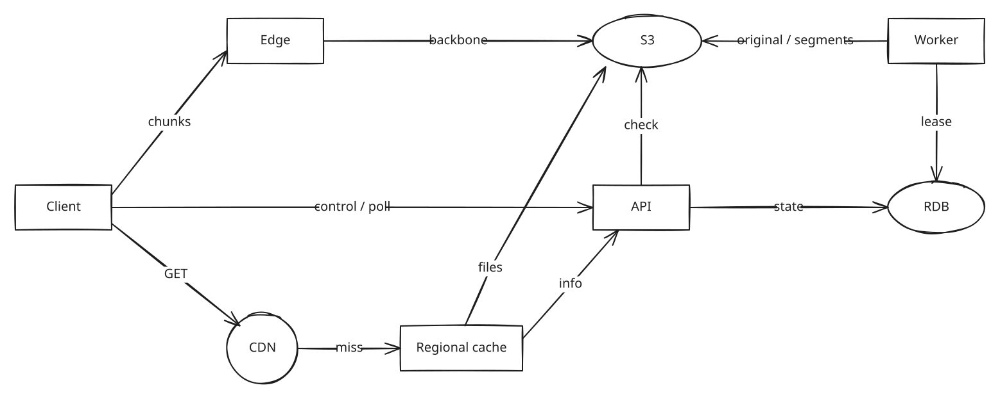
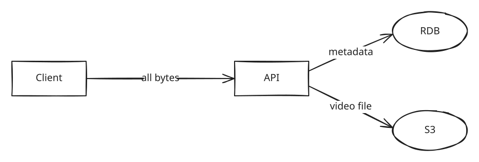
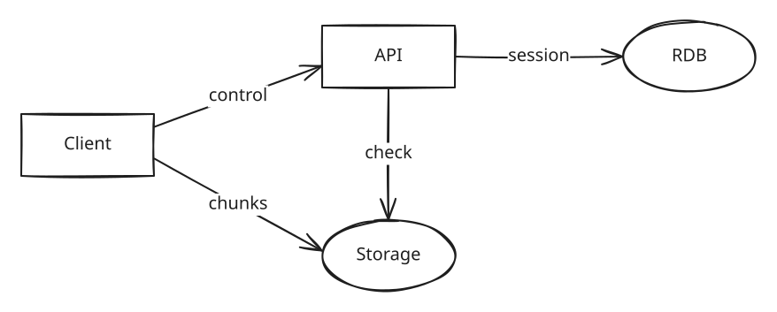
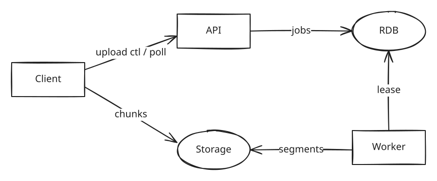
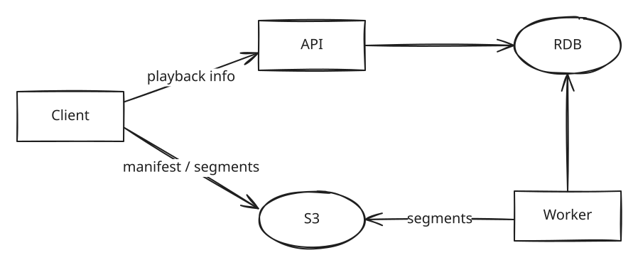
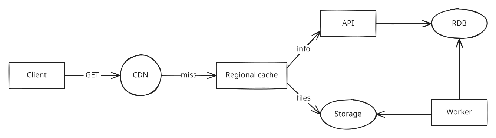
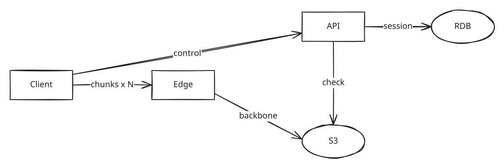

# 글로벌 동영상 서비스 설계하기

> 대용량 동영상을 업로드하고, 서로 다른 나라의 시청자가 자신의 기기와 네트워크에 맞는 화질로 빠르게 시청할 수 있는 서비스를 설계하세요. 업로드와 시청 중 연결이 끊겨도 복구 후 이어갈 수 있어야 합니다.

시스템 디자인 면접 연습입니다. 실제 YouTube 내부 구현이나 특정 회사의 출제 문제를 재현하는 명세가 아닙니다. 진행 방식은 [AGENTS.md](AGENTS.md), 이어갈 위치는 [진행 상태](docs/interview/progress.md)를 따릅니다.

**처음 읽는다면:** 1~7절에서 문제와 요구사항을 확인하고, [지금까지의 최종 구조](#지금까지의-최종-구조)에서 전체 그림과 요구사항별 상태를 본 뒤, [8절 설계 과정](#8-설계-과정)에서 가장 단순한 구조가 요구사항을 하나씩 만나며 바뀌는 과정을 그림과 함께 따라가세요. 결정의 자세한 비교는 [ADR 목록](docs/adr/README.md)에 있습니다. 아직 구현·측정한 것은 없고, 모든 수치는 연습용 가정과 그 계산입니다.

## 1. 사용자 이야기

- **업로더:** 큰 영상을 올리다가 모바일 연결이 끊겼다. 다시 연결되면 처음부터 올리고 싶지 않다.
- **업로더:** 전송을 마쳤다. 처리 중인지, 어떤 화질이 준비됐는지, 실패했는지 알고 싶다.
- **시청자:** 한국에서 올라온 영상을 브라질에서 본다. 거리가 멀어도 빠르게 재생을 시작하고 싶다.
- **시청자:** Wi-Fi에서 모바일로 바뀌거나 연결이 끊겼다. 가능한 화질로 시청하고, 복구·재접속 후 같은 기기에서 이어보고 싶다.

## 2. 이번에 다룰 범위

| 포함 | 제외 |
|---|---|
| 대용량 업로드·재개·처리 상태 | 구독·해지·알림함·모바일 푸시·구독 피드 |
| 여러 화질, 자동 전환, 위치 이동 | 추천·검색·댓글·좋아요·조회수·라이브 |
| 국가 간 재생 지연과 네트워크 변화·복구 | 광고·DRM·콘텐츠 검수·자막·지역 차단 |
| 같은 기기의 재접속 후 이어보기 | 기기 간 시청 위치 동기화·동시 기기 충돌 |
| | 오프라인 다운로드·원본 교체·비공개 영상 권한 설계 |

공개 영상과 같은 기기의 이어보기를 기준으로 시작합니다. 업로더 식별자는 주어진다고 가정하며 로그인 시스템 자체는 설계하지 않습니다. 공개 해제·삭제 후 이미 시작된 재생의 효력 같은 권한 정책은 이번 범위 밖입니다.

**원본 전송 완료와 서비스의 업로드 완료를 구분합니다.** 원본 전송·검증·보존 조건을 만족하면 원본 전송 완료이고, 이후에는 처리 중으로 표시합니다. 대상 화질 전체와 재생에 필요한 매니페스트가 준비되면 서비스의 업로드 완료·재생 가능으로 표시합니다. 일부 화질만 준비된 영상은 아직 시청할 수 없습니다. [ADR-0009](docs/adr/0009-all-renditions-ready.md)의 사용자 결정이며 구현·측정 결과는 아닙니다.

대상 화질은 지원 화질 중 원본 해상도 이하의 화질입니다. 예를 들어 1080p 원본은 360p·480p·720p·1080p 전체가, 720p 원본은 360p·480p·720p 전체가 준비되어야 합니다.

## 3. FR과 NFR은 무엇인가?

**FR (Functional Requirements)**은 제공해야 하는 기능과 결과입니다. 업로드 재개나 이어보기처럼 사용자가 할 수 있는 행동과 수용 기준으로 씁니다.

**NFR (Non-Functional Requirements)**은 그 기능의 품질과 제약입니다. 재생 지연·가용성·원본 보존처럼 측정 구간·조건·목표로 씁니다.

> 이어보기 기능은 FR입니다. 복구 후 얼마나 빨리 재생해야 하는지는 NFR입니다. 위치를 어디에 얼마나 자주 저장할지는 이후 설계 선택입니다.

## 4. FR: 무엇을 제공해야 하는가?

| ID | 기능 | 수용 기준 |
|---|---|---|
| FR-1 | 대용량 업로드와 재개 | 재개 유효 기간 안에 전송 완료가 확인된 부분을 활용해 이어 올린다. 원본 전체의 크기·무결성과 보존 조건을 확인한 뒤 원본 전송 완료 응답을 준다. 이 응답은 변환 완료를 뜻하지 않는다. |
| FR-2 | 처리 상태와 화질별 준비 확인 | 업로더는 전송 중·처리 중·업로드 완료(재생 가능)·처리 실패와 화질별 상태를 조회한다. 대상 화질 전체와 매니페스트가 준비되어야 업로드 완료로 표시하고 시청할 수 있다. |
| FR-3 | 여러 화질의 스트리밍 | 준비된 화질을 수동으로 선택하거나 자동 모드를 사용한다. 자동 모드는 네트워크 변화에 맞춰 재생 가능한 화질로 전환한다. |
| FR-4 | 위치 이동과 같은 기기의 이어보기 | 원하는 위치로 이동한다. 연결 복구 또는 앱 재접속 후, 해당 영상의 마지막으로 기억한 위치에서 재개한다. |

### 네트워크 상황을 구분하기

- **느려짐:** 연결은 유지되지만 받아올 수 있는 데이터가 줄어든 상황입니다. 화질과 재생 중 멈춤을 평가합니다.
- **완전 단절:** 새 데이터를 받을 수 없습니다. 이미 받은 구간이 끝나면 멈출 수 있으며 계속 재생을 보장하지 않습니다.
- **복구·재접속:** 같은 업로드나 영상을 찾아 이어가는 기능을 평가합니다. 단절 직전의 위치를 기억하지 못한 경우까지 정확한 위치 복구를 보장하는 것은 아닙니다.

## 5. NFR: 어떤 품질을 만족해야 하는가?

아래 수치는 모두 **면접관이 제시한 연습용 가정**입니다. 실제 서비스의 SLA나 측정값이 아니며, 사용자의 질문과 설계 검토를 통해 조정할 수 있습니다.

### 먼저 설계를 이끄는 목표

| ID | 지표와 측정 구간 | 목표와 조건 | 이유 |
|---|---|---|---|
| NFR-2 | 재생 시작: 재생 버튼부터 첫 프레임까지 | 기준 네트워크 p95 ≤ 2초, 취약 네트워크 p95 ≤ 4초. 지역별로 확인 | 먼 나라와 모바일 사용자도 고려 |
| NFR-4 | 재버퍼링: 최초 시작 이후 멈춘 시간 / 재생·멈춤 시간 | 연결이 유지된 기준 네트워크의 95% 세션에서 ≤ 1%. 사용자 일시정지 제외 | 높은 화질과 끊김 사이의 균형 |
| NFR-5 | 영상 준비: 원본 전송·검증 완료부터 대상 화질 전체와 매니페스트가 준비되어 재생 가능해질 때까지 | 10분 이하·최대 1080p의 지원 입력 영상에서 p95 측정. 목표값은 대표 영상의 변환·작업 대기 시간 검증 후 확정하며, p95 ≤ 5분은 검증 전 후보값 | 변환을 포함한 실제 처리 대기 시간을 평가 |
| NFR-6 | 월간 가용성과 경로 격리 | 유효 재생 요청 99.95%, 업로드 제어 요청 99.9%. 업로드·변환 장애 중에도 기존 영상 재생 목표 유지 | 긴 처리 작업이 시청을 방해하지 않아야 함 |
| NFR-7 | 전송 완료한 원본의 보존 | 저장 장치 또는 가용 영역 하나의 장애에서 원본 전송 완료 응답을 받은 원본을 복구할 수 있음 | 변환 중·처리 실패에도 원본 보존 조건을 유지 |
| NFR-8 | 같은 기기의 시청 복구 | 네트워크 복구를 감지하고 재개를 요청한 뒤 기준 네트워크 p95 ≤ 4초. 위치는 마지막으로 기억한 값을 사용 | 연결 복구 후 사용자 경험을 평가 |

### 해당 경로를 설계할 때 함께 볼 목표

| ID | 지표와 측정 구간 | 목표와 조건 |
|---|---|---|
| NFR-1 | 재생 정보 API: 서버 요청 수신부터 응답 생성까지 | p99 ≤ 500ms. 인터넷 왕복 시간 제외 |
| NFR-3 | 위치 이동: 이동 요청부터 해당 위치의 첫 프레임까지 | 기준 네트워크 p95 ≤ 2초 |

이 문제 카드에서는 동작과 측정 기준을 정의합니다. 현재 저장소·작업 전달·실패 처리 결정은 8절과 ADR을 따르며, 세부 복구 절차와 시청 위치 기록 방식·허용 오차는 남은 설계 항목입니다.

**원본 전송 시간과 영상 준비 시간은 별도 지표입니다.** 원본 전송 시간은 업로드 시작부터 원본 전송·검증 완료까지이며 파일 크기와 업로더 네트워크 조건별로 봅니다. 아직 수치 목표는 없습니다. NFR-5는 그 이후의 작업 대기·원본 읽기·변환·결과 저장·매니페스트 발행과 재생 가능 상태 반영까지 포함합니다. 10분을 넘는 영상은 별도로 측정하고 목표를 정해야 하며, 최대 2시간 영상에 5분 후보값을 적용하지 않습니다.

### 측정 조건과 숫자의 의미

- **기준 네트워크:** 다운로드 10Mbps, RTT 50ms. **취약 네트워크:** 1.5Mbps, RTT 300ms, 패킷 손실 1%. 연습용 프로필이며 영상의 평균 비트레이트와는 다른 값입니다.
- RTT 프로필은 시청자의 접근 네트워크 조건입니다. 업로드된 원본의 위치까지 왕복 시간이 50ms라는 가정은 아닙니다. 지역 간 추가 지연은 제안한 경로에서 별도로 계산합니다.
- 재생 지연은 앱이 열린 상태에서 측정하고 앱 시작·로그인 화면은 제외합니다. 재생 정보 확인과 첫 영상 데이터 수신·디코딩은 포함합니다.
- 지연은 지역·영상 인기 정도별로 보고, 캐시를 도입했다면 히트·미스를 나눠 확인합니다. 실패·타임아웃도 별도로 실패율에 기록하고 빠른 성공 요청만으로 목표를 만족했다고 판단하지 않습니다.
- 가용성은 서버 오류·타임아웃을 실패로 포함하고 잘못된 입력·사용자 취소는 제외합니다. 완전 단절은 재버퍼링 목표와 분리해 복구 동작을 평가합니다.

**500ms·1초·2초는 같은 지표·분위수·조건에서 비교해야 합니다.** 재생 시작 p95 1초는 같은 조건의 p95 2초보다 엄격합니다. 하지만 NFR-1의 서버 처리 500ms와 NFR-2의 사용자 재생 시작 2초는 서로 다른 구간입니다. 서버가 빠르더라도 네트워크·다운로드·디코딩 때문에 재생은 늦어질 수 있습니다.

## 6. 규모와 환경 가정

문제를 풀기 위한 입력 조건입니다. 실제 YouTube 사용량이나 기술 선택이 아닙니다. 단위는 별도 표시가 없으면 십진 단위입니다.

| 항목 | 연습용 가정 |
|---|---|
| 이용량 | DAU 1억 명, 인당 하루 시청 30분, 피크는 일평균의 3배 |
| 영상 전송 | 시청 중 평균 비트레이트 2.5Mbps. 취약 네트워크에서는 더 낮은 화질이 필요 |
| 업로드 | 하루 50만 개, 평균 원본 600MB, 최대 원본 20GB |
| 재개 기간 | 업로드 시작 후 7일. 기간 만료 후의 처리 방식은 설계에서 비교 |
| 영상·화질 | 녹화 영상, 최대 길이 2시간, 입력 해상도 360p~1080p. 지원 화질은 360p·480p·720p·1080p이며 원본 해상도 이하의 대상 화질 전체가 준비되어야 시청 가능. 원본보다 높은 화질은 요구하지 않음 |
| 지역·기기 | 업로더와 시청자는 전 세계에 분포. 모바일·데스크톱·TV 지원. 지역별 분포는 글로벌 경로를 설계할 때 추가 가정 |

평균 동시 시청자는 `1억 × 30분 / 1,440분 ≈ 208만 명`, 피크는 약 625만 명입니다. **가정에서 얻은 계산**이며 측정값이 아닙니다. 상세 전송·저장 계산은 해당 설계 단계에서 채웁니다. 업로드 단위 크기와 요청 수는 재개 방식을 비교한 뒤 계산합니다.

## 7. 시작에 필요한 배경지식

- **대역폭과 RTT:** 대역폭은 시간당 전송 가능한 데이터량, RTT는 왕복 시간입니다. 파일 다운로드와 여러 순차 요청은 다른 병목을 만들 수 있습니다.
- **화질·비트레이트·크기:** 해상도는 픽셀 수이고 비트레이트는 초당 데이터량입니다. 대략적인 크기는 평균 비트레이트 × 길이이며, 비트와 바이트를 구분합니다. 같은 해상도라도 코덱·프레임률·내용에 따라 필요한 데이터량은 달라집니다.
- **코덱과 컨테이너:** 코덱은 영상·음성의 압축·복원 방식이고 컨테이너는 그 데이터와 관련 정보를 담는 파일 형식입니다. 특정 형식의 선택은 재생 경로를 설계할 때 비교합니다.
- **p95·p99:** 정의한 표본의 95%·99%가 해당 값 이하라는 의미입니다. 평균이나 최악값과 같지 않습니다.
- **가용성과 보존:** 지금 요청에 응답할 수 있는지와 저장한 데이터를 복구할 수 있는지는 다른 요구사항입니다.

## 8. 설계 과정

가장 단순한 구조에서 출발해, 요구사항 하나를 만날 때마다 구조를 한 번씩 바꿉니다. 각 단계는 **무엇이 필요한가 → 이전 구조로는 왜 안 되는가 → 그림 → 비교한 방법 → 고른 방법과 이유 → 얻은 것과 치른 비용** 순서로 읽으면 됩니다.

### 먼저 알아둘 말

| 말 | 뜻 |
|---|---|
| Client | 업로더·시청자의 앱이나 브라우저 |
| API | 우리가 운영하는 백엔드 서버. 요청을 받아 판단하고 기록한다 |
| RDB | 영상 상태, 업로드 세션, 변환 작업 같은 작은 정보를 저장하는 데이터베이스 |
| S3 | 영상 원본·세그먼트·매니페스트를 저장하는 객체 저장소(Amazon S3, 한국 리전). 파일(객체)마다 URL로 읽고 쓴다. 기본 저장 등급(S3 Standard)은 데이터를 3개 이상의 가용 영역에 나눠 저장한다([문서](https://docs.aws.amazon.com/AmazonS3/latest/userguide/storage-class-intro.html#sc-compare)) |
| 청크 | 큰 원본을 업로드하기 위해 나눈 조각 |
| 세그먼트 | 재생을 위해 변환 결과를 4초 단위로 자른 조각 |
| 매니페스트 | 어떤 화질이 있고 각 세그먼트가 어디 있는지 적은 목록 파일 |
| CDN | 전 세계 여러 지점에 파일 사본을 두고 가까운 곳에서 내주는 캐시 네트워크 |
| Edge | 사용자 가까운 곳에서 연결을 받아 사업자 망으로 원본까지 데이터를 전달하는 중계 지점. 캐시와 달리 저장하지 않는다 |
| backbone | 클라우드·CDN 사업자가 자기 Edge와 리전 사이에 운영하는 장거리 전용망(본문의 "사업자 망"). 공용 인터넷 구간을 Client와 Edge 사이로 줄인다 |
| Regional cache | CDN 지점들과 원본(한국 S3) 사이에 지역마다 두는 중간 캐시. 같은 지역 지점들의 캐시 미스를 모아 원본까지 가는 요청을 줄인다. 계층형 캐시(tiered caching)의 중간층이며 AWS CloudFront의 [Regional Edge Cache](https://docs.aws.amazon.com/AmazonCloudFront/latest/DeveloperGuide/HowCloudFrontWorks.html#CloudFrontRegionaledgecaches)에 해당한다 |

그림에서 사각형은 실행되는 구성요소, 타원은 저장소, 원은 CDN입니다. 화살표는 **요청을 보내는 방향**입니다. 읽기(GET)라면 데이터는 화살표와 반대로 흐릅니다. 예를 들어 `files`는 Regional cache가 S3에 요청하고 파일을 받아 오는 길입니다.

### 단계 요약

| 단계 | 만나는 요구사항 | 바뀐 점 | 결정 |
|---|---|---|---|
| 0 | 올리고 볼 수 있어야 한다 | Client → API → RDB·S3 | 출발점 |
| 1 | 20GB를 끊겨도 이어 올린다 (FR-1, NFR-7) | 청크를 S3로 직접 보내고, API는 확인만 한다 | [ADR-0001](docs/adr/0001-upload-progress-and-completion.md) |
| 2 | 전체 화질 준비 후 시청 가능하고 변환이 기존 재생을 방해하지 않는다 (FR-2, NFR-5, NFR-6) | 변환 작업자와 작업 표, 상태 폴링, 전체 준비 완료 판정 | [ADR-0002](docs/adr/0002-processing-status-check.md), [0003](docs/adr/0003-transcoding-executor.md), [0004](docs/adr/0004-transcoding-failure-handling.md), [0009](docs/adr/0009-all-renditions-ready.md) |
| 3 | 네트워크가 바뀌어도 멈추지 않고 화질을 바꾼다 (FR-3, FR-4, NFR-4) | 4초 세그먼트와 매니페스트, Client가 화질 판단 | [ADR-0005](docs/adr/0005-playback-segments.md) |
| 4 | 먼 나라에서도 빨리 재생을 시작한다 (NFR-2) | CDN과 중간 캐시, 짧게 캐시하는 재생 정보 | [ADR-0006](docs/adr/0006-global-delivery.md) |
| 5 | 먼 나라에서도 큰 원본을 올린다 (FR-1, NFR-7) | 청크 병렬 업로드와 가까운 엣지 중계 | [ADR-0007](docs/adr/0007-global-upload-path.md) |

### 지금까지의 최종 구조

단계 0~5를 모두 반영한 현재 구조입니다. 각 단계의 이유는 아래 단계별 설명에 있습니다.

**길 네 개로 나뉜다**

| 길 | 화살표 | 하는 일 |
|---|---|---|
| 업로드 | Client → Edge → S3 (`chunks`, `backbone`) | 청크를 여러 개 동시에 가까운 Edge로 보내고, Edge가 사업자 망으로 한국 S3에 전달한다 |
| 제어 | Client → API → RDB·S3 (`control / poll`, `state`, `check`) | 업로드 시작·재개·원본 전송 완료, 처리 상태 조회. 재개·원본 전송 완료 때 API가 S3를 확인한다 |
| 변환 | Worker → RDB·S3 (`lease`, `original / segments`) | RDB에서 작업을 임대하고, S3에서 원본을 읽어 4초 세그먼트와 매니페스트를 만들어 S3에 쓴다 |
| 재생 | Client → CDN → Regional cache → S3·API (`GET`, `miss`, `files`, `info`) | 재생 정보·매니페스트·세그먼트를 가까운 곳에서 받고, 없을 때만 원본까지 간다 |

**구성요소가 생긴 순서**

| 단계 | 새로 생기거나 바뀐 것 | 왜 |
|---|---|---|
| 0 | Client, API, RDB, S3 | 올리고 보는 최소 구조 |
| 1 | 청크를 S3로 직접 보냄 | 끊겨도 이어 올리고 API 재배포에 영향받지 않게 |
| 2 | Worker, RDB 작업 표 | 변환을 API와 분리하고 실패한 작업을 회수 |
| 3 | 세그먼트·매니페스트(데이터 형태) | 재생 중 화질 전환, 위치 이동 |
| 4 | CDN, Regional cache | 먼 나라 재생 시작 시간 |
| 5 | Edge | 먼 나라 업로드 처리량 |

**요구사항별로 어디까지 왔나**

상태는 네 가지로 구분합니다. **설계됨**은 구조와 동작이 정해졌다는 뜻이고, **계산상 충족**은 가정으로 계산하면 목표 안에 든다는 뜻이며, **방향만**은 구조는 있지만 계산이나 세부가 없다는 뜻이고, **미설계**는 아직 다루지 않았다는 뜻입니다. 구현과 측정은 어느 항목도 하지 않았습니다.

| 요구사항 | 어떻게 만족하나 | 단계·ADR | 상태 |
|---|---|---|---|
| FR-1 업로드와 재개 | 청크 병렬 업로드, 재개·원본 전송 완료 때 S3 조회, 크기·체크섬 검증 후 원본 확정. 해외는 Edge 중계 | 1, 5 · [0001](docs/adr/0001-upload-progress-and-completion.md), [0007](docs/adr/0007-global-upload-path.md), [0009](docs/adr/0009-all-renditions-ready.md) | 기본 흐름 설계됨. 원본 확정 중 장애·재시도는 남음 |
| FR-2 처리 상태와 화질별 준비 | RDB에 화질별 상태를 기록하고 Client가 폴링. 대상 화질 전체와 매니페스트 준비 후 업로드 완료·재생 가능 | 2 · [0002](docs/adr/0002-processing-status-check.md), [0004](docs/adr/0004-transcoding-failure-handling.md), [0009](docs/adr/0009-all-renditions-ready.md) | 완료·실패 정책 결정됨. 최종 발행·상태 갱신의 원자성은 남음 |
| FR-3 여러 화질 스트리밍 | 매니페스트의 화질 목록에서 수동 선택, Client가 처리량·버퍼로 자동 선택 | 3 · [0005](docs/adr/0005-playback-segments.md) | 설계됨 |
| FR-4 위치 이동 | 이동한 시각의 세그먼트부터 요청 | 3 · [0005](docs/adr/0005-playback-segments.md) | 설계됨 |
| FR-4 같은 기기 이어보기 | 마지막 위치를 어디에 얼마나 자주 기록할지 | — | 미설계 |
| NFR-1 재생 정보 API p99 ≤ 500ms | 재생 정보를 CDN이 몇 초 캐시해 API 요청이 줄어든다. API 내부 처리는 아직 보지 않음 | 4 · [0006](docs/adr/0006-global-delivery.md) | 방향만 |
| NFR-2 재생 시작 | CDN·Regional cache·예측 push, 재생 정보 캐시. 캐시가 있으면 기준 약 0.6초, 취약 약 3.5초 | 3, 4 · [0005](docs/adr/0005-playback-segments.md), [0006](docs/adr/0006-global-delivery.md) | 계산상 충족(캐시 적중 시). 첫 시청자 캐시 미스는 미확인 |
| NFR-3 위치 이동 p95 ≤ 2초 | 4초 세그먼트 하나만 받으면 된다 | 3 · [0005](docs/adr/0005-playback-segments.md) | 방향만 |
| NFR-4 재버퍼링 ≤ 1% | Client가 버퍼를 보며 화질을 내림, 가까운 CDN | 3, 4 | 방향만 |
| NFR-5 전체 화질 영상 준비 시간 | 원본 전송·검증 완료부터 대상 화질 전체·매니페스트 준비와 재생 가능 상태 반영까지 측정 | 2 · [0003](docs/adr/0003-transcoding-executor.md), [0004](docs/adr/0004-transcoding-failure-handling.md), [0009](docs/adr/0009-all-renditions-ready.md) | 측정 구간 결정됨. 5분은 후보값이며 목표 확정·측정 전 |
| NFR-6 가용성과 경로 격리 | 업로드 바이트·변환·재생이 서로 다른 길. API가 멈춰도 캐시된 재생 정보로 공개 영상 재생 | 1~5 | 격리는 설계됨. 99.95% 같은 가용성 수치와 RDB 장애는 미설계 |
| NFR-7 전송 완료한 원본 보존 | S3 멀티파트 완료와 검증이 끝난 뒤에만 원본 전송 완료 응답. 전체 화질 변환을 기다리지 않고 원본 보존 조건 적용 | 1, 5 · [0001](docs/adr/0001-upload-progress-and-completion.md), [0007](docs/adr/0007-global-upload-path.md), [0008](docs/adr/0008-object-storage-s3.md), [0009](docs/adr/0009-all-renditions-ready.md) | 설계됨(S3 Standard는 3개 이상 가용 영역에 저장. 문서 기준이며 미측정) |
| NFR-8 같은 기기 시청 복구 | — | — | 미설계 |

### 단계 0. 가장 단순한 구조

**필요한 것:** 업로더가 영상을 올리고, 다른 사용자가 그 영상을 재생한다.

- Client는 모든 요청을 API로 보낸다.
- API는 제목·상태 같은 메타데이터를 RDB에, 영상 파일을 S3에 저장한다.
- 영상 파일은 RDB에 넣지 않는다. 최대 20GB 파일을 RDB 행에 넣으면 백업·복제가 무거워지고, 재생하는 동안 DB 연결을 오래 붙잡는다.

**이 구조의 한계:** 영상 바이트가 모두 API를 지나간다. 20GB를 올리는 중에 API 서버를 재배포하면 업로드가 처음부터 다시 시작된다. 시청자 데이터도 모두 API를 지나가 서버 부담이 커진다.

### 단계 1. 끊겨도 이어 올리기

**필요한 것:** 연결이 끊겨도 이미 보낸 부분은 다시 보내지 않는다(FR-1). 원본 전송 완료라고 응답한 원본은 잃어버리지 않는다(NFR-7).

**흐름**

1. **시작:** Client가 크기와 청크 수를 알린다. API는 업로드 세션을 RDB에 기록하고 청크를 올릴 URL을 준다.
2. **업로드:** Client가 청크를 S3에 **직접** 올린다. 각 청크의 성공 여부는 S3가 바로 알려준다.
3. **재개:** 끊겼다가 돌아오면 API가 S3에 "어떤 청크가 있나"를 물어보고 남은 번호를 알려준다.
4. **원본 전송 완료:** Client가 전송 완료를 요청하면 API가 모든 청크, 전체 크기, 체크섬을 S3에서 확인한다. 확인이 끝난 뒤 원본을 확정하고 원본 전송 완료를 응답한다. 이후 영상은 처리 중이며, 서비스의 업로드 완료·재생 가능은 단계 2의 전체 화질 준비 조건을 따른다.

**비교한 방법:** "어디까지 올라갔나"를 무엇으로 판단할지 세 가지를 비교했다.

| 방법 | 문제 |
|---|---|
| Client가 청크마다 API에 보고 | 저장은 됐는데 보고 직전에 끊기면 기록이 실제와 어긋난다 |
| S3 이벤트를 받아 RDB에 기록 | 이벤트가 늦게 오거나, 두 번 오거나, 안 오는 경우를 따로 처리해야 한다 |
| **재개·완료할 때 S3를 직접 조회** | 재개할 때 조회가 한 번 늘어난다 |

**선택과 이유:** 바이트가 실제로 있는 S3 한 곳만 기준으로 삼으면 두 기록을 맞출 일이 없다. 원본 전송 완료는 Client가 아니라 API가 검증한 뒤 확정한다.

**얻은 것과 비용:** API를 재배포해도 업로드가 끊기지 않는다. 대신 재개할 때 S3 조회가 한 번 더 든다.

### 단계 2. 변환하고 처리 상태 보여주기

**필요한 것:** 원본 전송·검증이 끝나면 원본 해상도 이하의 대상 화질을 만든다. 업로더는 처리 상태와 화질별 준비·실패를 볼 수 있다(FR-2). 대상 화질 전체와 매니페스트가 준비되어야 업로드 완료·재생 가능이다. 원본 전송·검증 완료부터 그 시점까지의 p95를 측정하며, 5분은 검증 전 후보값이다(NFR-5). 변환이 실패해도 다른 영상의 재생은 영향을 받지 않는다(NFR-6).

**이전 구조의 한계:** API 서버가 직접 변환하면 세 가지 문제가 생긴다.

- 변환은 CPU를 거의 다 쓴다. 그래서 같은 서버의 API 응답이 느려진다.
- 몇 분 걸리는 변환 도중에 서버가 죽으면 영상이 "처리 중"에 갇힌다.
- API는 요청 수에 맞춰, 변환은 업로드량에 맞춰 늘려야 해서 늘리는 기준이 다르다.

**흐름**

1. 원본 전송·검증이 완료되면 API가 RDB 작업 표에 대상 화질별 작업을 넣는다. 1080p 원본은 4개, 720p 원본은 3개다. 기존 360p 우선순위는 유지하되 360p만 준비되어도 공개하는 것은 아니다.
2. Worker(변환 작업자)가 할 일을 조회해 작업을 가져간다. 이때 **임대**(lease)를 받는다. 임대는 "2분간 이 작업은 내 것"이라는 기록이다. 작업 중이면 30초마다 임대를 연장한다.
3. Worker가 죽거나 멈추면 임대가 연장되지 않아 만료된다. 할 일을 찾던 다른 Worker가 그 작업을 가져가 처음부터 다시 한다. 따로 감시하는 서버가 없다.
4. 결과는 시도마다 다른 경로(`영상/화질/시도N/`)에 저장한다. RDB에는 **현재 임대 번호와 같을 때만** "준비됨"을 기록한다. 그래서 늦게 끝난 옛 작업자가 결과를 덮어쓰지 못한다.
5. 대상 화질 작업이 시도 횟수 상한(3회)에 도달해 최종 실패하면 해당 작업과 영상을 "처리 실패"로 표시한다. 일부 화질이 성공했어도 전체 준비 조건을 만족하지 못하므로 시청 가능으로 바꾸지 않는다. 준비된 결과를 지우거나 다른 작업을 중단할지는 아직 정하지 않았다.
6. 대상 화질 전체의 결과와 그 화질을 담은 매니페스트가 준비되면 "업로드 완료·재생 가능"으로 표시한다. 매니페스트 발행과 최종 상태 갱신의 원자성은 남은 설계 항목이다.
7. Client는 3~5초마다 API에 상태를 묻는다(폴링). 단계 1의 원본 전송 완료 응답과 이 단계의 서비스 업로드 완료 표시는 서로 다른 시점이다.

**상태 전이와 실패 정책**

| 상태 | 의미와 전환 조건 | 시청 가능 여부 |
|---|---|---|
| 전송 중 | 원본 청크를 올리는 중 | 불가 |
| 처리 중 | 원본 전송·검증·보존 조건 충족 후 대상 화질 변환과 결과 준비 중. 일부 화질만 성공했어도 이 상태 유지 | 불가 |
| 업로드 완료·재생 가능 | 대상 화질 전체와 재생에 필요한 매니페스트가 준비됨 | 가능 |
| 처리 실패 | 대상 화질 중 하나가 시도 횟수 상한에 도달해 최종 실패함 | 불가 |

이 표는 사용자에게 보여줄 변환 관련 상태와 완료 정책이다. 업로드 세션의 검증 실패·만료, 원본 확정 중 장애 복구, 처리 실패 후 수동 재처리는 아직 정하지 않았다. 원본 전송 완료는 처리 중으로 넘어가는 경계이며, NFR-7의 원본 보존 조건은 이때부터 적용한다.

**멘토가 "360p가 준비됐는데 왜 바로 공개하지 않나요?"라고 묻는다면:**

> 대상 화질 전체가 준비된 시점을 서비스의 업로드 완료로 정했습니다. 일부 화질만 준비된 영상은 처리 중으로 보여주고 공개하지 않습니다. 대신 가장 늦은 대상 화질이 준비될 때까지 공개가 늦어지는 비용을 감수합니다. 원본 전송 완료는 별도 응답으로 알리며, 그 이후의 작업 대기·변환·저장·매니페스트 발행까지 영상 준비 시간으로 측정합니다. p95 5분은 측정 전 후보값입니다.

**비교한 방법**

| 질문 | 고른 것 | 고르지 않은 것과 이유 |
|---|---|---|
| 누가 변환하나 | 자체 Worker | API 직접(자원 경쟁), 외부 변환 서비스(이 규모에서 비용, 완료 신호 유실 대응) |
| 실패를 어떻게 알아채나 | 작업 임대 | 중앙 헬스체크(감시 서버가 단일 장애점, 멈춘 작업을 놓침), 주기적 정리만(주기에 따라 작업 회수와 영상 준비가 늦어짐) |
| 작업 대기열 | RDB 작업 표로 시작 | 별도 큐는 부하가 생기면 도입. 지금은 초당 수십 건 수준[계산] |
| 상태를 어떻게 알리나 | 폴링 | SSE(연결 유지·전달 경로가 필요하고, 이 규모에서는 폴링 부하도 작음) |

**얻은 것과 비용:** 변환이 기존 영상 재생과 분리되고, 감시 서버 없이 실패한 작업이 회수된다. 시청 시작부터 대상 화질 전체를 선택할 수 있다. 대신 가장 늦은 화질까지 공개를 기다리고, 대상 화질 하나의 최종 실패도 서비스 업로드 완료를 막는다. 같은 작업이 두 번 실행되면 CPU를 낭비하고, 버려진 시도 결과를 지우는 정리 작업이 필요하다.

### 단계 3. 네트워크가 바뀌어도 멈추지 않고 재생하기

**필요한 것:** 720p로 보다가 네트워크가 10Mbps에서 1.5Mbps로 떨어져도 멈추지 않고 화질을 낮춘다(FR-3, NFR-4). 원하는 위치로 이동하고, 끊겼다가 복구되면 이어서 본다(FR-4).

**이전 구조의 한계:** 화질마다 2시간짜리 파일 하나뿐이면, 재생 도중에 다른 화질의 같은 위치로 옮겨 탈 지점이 없다.

**흐름**

1. Worker는 화질마다 결과를 **4초 세그먼트**로 자른다. 모든 화질이 같은 시각 경계에서 잘리고, 각 세그먼트는 혼자 화면을 만들 수 있는 프레임(키프레임)으로 시작한다. 화질 목록과 세그먼트 주소는 매니페스트에 적는다.
2. Client가 API에서 재생 정보(매니페스트 위치)를 받는다.
3. Client가 S3에서 매니페스트와 세그먼트를 HTTP로 하나씩 받는다.
4. Client는 방금 받은 세그먼트의 다운로드 속도와 미리 받아 둔 분량을 보고 다음 세그먼트의 화질을 고른다.

예를 들어 1.5Mbps에서 720p 4초 세그먼트(약 10Mb)는 받는 데 약 6.7초가 걸려 재생보다 느리다. 480p(약 4.8Mb)는 약 3.2초라 재생을 따라간다. 그래서 다음 세그먼트부터 480p로 내린다. 화질별 비트레이트는 가정값이고 위 수치는 그 계산이다.

**비교한 방법**

| 방법 | 고르지 않은 이유 |
|---|---|
| 화질별 파일 하나 + 구간 요청 | 시각을 바이트 위치로 바꾸는 색인이 필요하고 전환이 거칠다 |
| 서버가 시청자마다 영상을 밀어주는 송출 서버 | 피크 약 625만 명의 연결을 서버가 유지해야 하고, 일반 캐시를 쓸 수 없다 |
| 서버가 화질을 결정 | 네트워크 상태는 Client가 가장 정확히 안다. 서버에 물으면 왕복이 늘어난다 |

**세그먼트 길이:** 2·4·6초를 비교했다. 6초는 취약 네트워크에서 첫 세그먼트를 받는 데만 약 2.8초가 걸린다. 재생 시작 계산이 약 4.3초로 NFR-2의 4초를 넘는다. 그래서 4초(약 3.4초)를 골랐다. 순차 왕복 5회와 360p 0.7Mbps는 가정이다.

**얻은 것과 비용:** 재생 경로에는 시청자별 서버 상태가 없다. 위치 이동과 **재생 중** 네트워크 복구는 해당 세그먼트를 다시 요청하면 끝난다. 앱을 다시 켠 뒤 마지막 위치에서 이어보는 기능(FR-4, NFR-8)은 위치를 기록해야 해서 아직 설계하지 않았다. 대신 파일과 요청 수가 많다. 10분 영상 하나가 4개 화질에서 약 600개 파일이 된다.

### 단계 4. 먼 나라에서도 빨리 재생 시작하기

**필요한 것:** 한국에서 올린 영상을 브라질에서 볼 때도 재생 시작이 기준 네트워크 p95 2초, 취약 네트워크 p95 4초 안에 들어와야 한다(NFR-2).

**이전 구조의 한계:** 모든 것이 한국 리전에 있으면 브라질에서 한 번 왕복하는 데 약 350~600ms가 걸린다. 서울–상파울루 지역 간 왕복을 약 300ms로 가정했고, 여기에 접근 네트워크 왕복이 더해진다. 재생 시작까지 왕복이 다섯 번쯤 필요하니 계산상 기준 네트워크 약 2.0초, 취약 네트워크 약 4.9초가 걸려 목표를 넘는다.

**흐름**

1. **영상 파일(매니페스트·세그먼트):** Client는 가까운 CDN 지점에서 받는다. 지점에 없으면 지역 중간 캐시(Regional cache, 예: 남미)에서, 거기에도 없으면 한국 S3에서 가져온다. 중간 캐시가 없으면 상파울루·리우 등 남미 지점마다 각자 한국까지 가지만, 있으면 그 지역에서 한국까지 가는 요청은 영상 파일당 대략 한 번으로 줄어든다. 그 지역의 첫 시청자만 잠시 느리고, 다음 시청자부터는 가까운 곳에서 받는다.
2. **선택적 미리 넣기(push):** 구독자가 많은 채널의 새 영상이나 공개 직후 요청이 빠르게 느는 영상은 첫 세그먼트 몇 개를 CDN에 미리 넣는다. 이미 재생 수가 많아진 뒤에는 이미 캐시돼 있어 효과가 없으므로, 몰리기 **전의** 신호로 판단한다.
3. **재생 정보:** 공개 영상의 재생 정보는 누구에게나 같다. 그래서 CDN이 몇 초 동안 캐시한다. 응답을 합쳐 왕복 횟수도 줄인다.

**무엇을 얼마나 오래 캐시하나**

| 정보 | 바뀌나 | 캐시 |
|---|---|---|
| 세그먼트 (`화질/시도N/seg001`) | 안 바뀜. 결과가 바뀌면 경로가 바뀜 | 길게 |
| 매니페스트 (`manifest-vN`) | 발행한 버전은 안 바뀜. 시청자에게 제공하는 버전에는 대상 화질 전체가 포함됨 | 길게 |
| 재생 정보 ("지금 최신은 vN") | 바뀜 | 몇 초 |

같은 매니페스트 URL을 덮어쓰면 CDN에 이전 내용이 남을 수 있으므로 버전 경로를 유지한다. 현재 정책에서는 대상 화질 전체가 준비된 매니페스트만 시청자에게 제공하며, 변환 중 일부 화질만 담긴 목록은 공개하지 않는다. 재생 정보의 처리 중 → 재생 가능 변화는 짧은 캐시 수명만큼 늦게 보일 수 있다. 변환 중 내부 버전을 만드는 방식과 최종 발행 절차는 별도로 정한다([ADR-0009](docs/adr/0009-all-renditions-ready.md)).

> **용어 주의:** 여기서 말하는 지역 중간 캐시는 원본 앞에 한 곳만 두는 "shield"와 다르다. AWS의 [Origin Shield](https://docs.aws.amazon.com/AmazonCloudFront/latest/DeveloperGuide/origin-shield.html), Fastly의 [Shielding](https://www.fastly.com/documentation/guides/concepts/shielding/), Cloudflare [Tiered Cache](https://developers.cloudflare.com/cache/how-to/tiered-cache/)의 상위층, Akamai [Tiered Distribution](https://techdocs.akamai.com/property-mgr/reference/latest-tiered-distribution)의 부모 서버는 모두 원본 근처에서 전 세계 미스를 한 번 더 모으는 층이다. 이 설계는 아직 그 층을 두지 않았고, 원본 부하가 문제가 될 때 검토한다.

**계산으로 본 효과**

| 구성 | 기준 네트워크 | 취약 네트워크 |
|---|---|---|
| 한국만 | 약 2.0초 | 약 4.9초 |
| 영상만 CDN (캐시 있음) | 약 1.2초 | 약 4.0초 |
| 재생 정보도 가까이 + 영상 CDN | 약 0.6초 | 약 3.5초 |

모두 가정에서 나온 계산이며 측정값이 아니다. 취약 네트워크에서는 접근 네트워크 왕복과 다운로드가 대부분을 차지한다. 그래서 재생 정보까지 가까이 두어야 목표 안에 들어온다.

**얻은 것과 비용:** 캐시가 있으면 계산상 두 목표를 모두 만족한다. 한국 API가 잠깐 멈춰도 캐시된 재생 정보로 공개 영상 재생이 이어진다. 대신 CDN 전송 비용이 들고, 지점과 중간 캐시 모두에 없는 첫 시청자는 느리다. 전체 준비 후 재생 가능 상태는 재생 정보 캐시 수명만큼 늦게 보인다.

### 단계 5. 먼 나라에서 큰 원본 올리기

**필요한 것:** 브라질 업로더도 최대 20GB 원본을 올릴 수 있어야 한다. 끊기면 이어 올리고(FR-1), 원본 전송 완료 응답을 준 원본은 잃어버리지 않는다(NFR-7).

**이전 구조의 한계:** 청크를 한국 S3로 바로 보내면 브라질에서 왕복이 약 350ms 걸린다. TCP는 상대의 수신 확인을 받으며 보내는 양을 늘리므로, 연결 하나의 처리량은 대략 왕복 시간에 반비례해 떨어진다. 업로더 회선이 20Mbps라고 가정하면, 회선을 다 쓸 때 20GB는 약 2.2시간 걸린다. 연결 하나가 5Mbps밖에 못 내면 약 8.9시간이 걸린다. 업로드가 길수록 끊길 일도 많아진다.

**캐시를 쓰면 안 되는 이유:** 재생처럼 CDN·지역 캐시에 올려 두면 될 것 같지만, 두 가지 이유로 안 된다. 캐시는 읽기(GET) 응답을 저장하는 장치라 업로드는 원본으로 그대로 넘긴다. 또 캐시는 언제든 지워질 수 있어 완료 후 보존을 약속할 수 없다.

**흐름**

1. 시작·재개·원본 전송 완료는 단계 1과 같다. API가 세션을 기록하고, 재개·원본 전송 완료 때 한국 S3를 조회한다.
2. Client는 청크 여러 개를 **동시에** 서로 다른 연결로 보낸다. 청크마다 따로 재개되므로 병렬로 보내도 문제가 없다.
3. 청크 업로드 주소는 가까운 **Edge**를 가리킨다. Edge는 청크를 저장하지 않고, 사업자 망으로 한국 S3에 바로 전달한다.
4. 한국 S3가 청크를 저장한 뒤에야 Client가 성공 응답을 받는다. Edge가 먼저 성공을 알리고 나중에 보내는 방식(비동기)이 아니다. 그렇게 하면 그 사이 데이터가 Edge에만 있어 보존을 약속할 수 없다.

**비교한 방법**

| 방법 | 판단 |
|---|---|
| 한국 S3 직접 + 병렬 | 채택. 구조를 바꾸지 않고 연결 수로 처리량 손실을 메운다 |
| 가까운 Edge 중계 | 채택. Client 쪽 왕복을 줄이고 장거리는 사업자 망에 맡긴다. 예: [AWS S3 Transfer Acceleration](https://docs.aws.amazon.com/AmazonS3/latest/userguide/transfer-acceleration.html) |
| 가까운 리전 S3에 저장 후 한국으로 복제 | 보류. 원본 전송 완료는 빨라질 수 있지만 세션·재개·변환이 리전별로 나뉜다. 측정상 부족하거나 지역 저장 요구가 생기면 검토 |

**얻은 것과 비용:** 원본 전송의 진행 기준과 완료 판정은 여전히 한국 S3 한 곳이다. 전체 화질 준비에 따른 서비스 업로드 완료는 단계 2에서 판정한다. 원본 전송은 더 빨라지고 덜 끊길 것으로 기대한다(미측정). 대신 엣지 중계 전송 요금이 들고 동시 연결이 늘어난다. 원본 전송 시간의 수치 목표는 아직 정하지 않았다.

### 지금 남은 질문

- 업로드 속도 목표를 NFR로 둘지(현재 없음).
- PR #9 리뷰에서 나온 남은 경계 상황: 원본 전송 완료 처리 중 장애와 재시도, 원본 전송 완료 기록과 변환 작업 생성의 원자성, 오래된 작업자의 실패 보고, 매니페스트 발행과 전체 준비 상태 갱신의 원자성, 캐시 미스 비율 목표, push 신호(구독자 수는 범위 밖), 파트 크기 상한. 화질별 최종 실패가 서비스 업로드 완료를 막는 정책은 [ADR-0009](docs/adr/0009-all-renditions-ready.md)로 확정했다.
- 전체 화질 준비 시간의 p95 목표값(5분은 검증 전 후보), 10분 초과 영상의 준비 시간 목표, 처리 실패 후 재처리·성공 결과 보존 정책.
- 같은 기기에서 연결 복구·앱 재접속 후 이어보기(FR-4, NFR-8).
- 미검증 항목: 화질별 변환 시간, 임대 시간과 재시도 간격, 실제 재생 시작 시간과 캐시 적중률, 해외 업로드 시간, CDN·변환·엣지 중계 비용.

그림 원본은 [excalidraw/src](excalidraw/src)에 있고, 다시 만드는 방법은 [scripts/excalidraw/README.md](scripts/excalidraw/README.md)에 있습니다.
